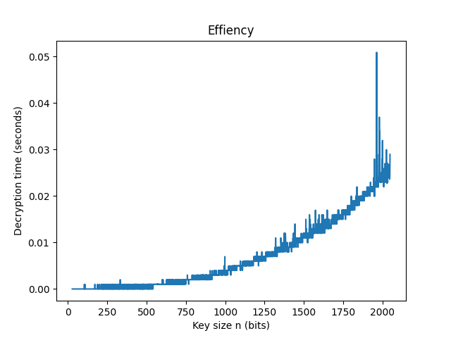

# 💻🔍RSA Cryptography 

## About:
RSA (Rivest–Shamir–Adleman) is a public-key cryptosystem that is widely used for secure data
transmission.

This assignment is to implement chat app to exchange secure messages encrypted/decrypted using RSA and analyze its effiency and security.

## Built with:
Python
## How to run:
### To use, run first if not installed before:
`pip install sockets` `pip install sympy` `pip install matplotlib`

### To start chatting
- Open 2 terminals
- Run at the 1st terminal `python client.py`
- Run at the 2nd terminal `python server.py`
- Start Sending from server side first.
- To close connection, enter Ctrl+c instead of sending a message.

### To test efficiency 
`python effiencyAnalysis.py`
### To test attacks 
`python attackAnalysis.py`

## Files:
- **chatting:**  ( `chatFunctions.py`, `client.py`, `server.py` )
- **Algorithm & Conversions:** ( `alphabet.py`, `charConversion.py`, `rsa.py`)
- **effiencyAnalysis:** ( `effiencyAnalysis.py`, `effiency_test.txt`, `effiency_results.txt`)
- **Attack:** (`attackAnalysis.py`, `attack.py`, `attack_test.txt`, `attack_results.txt`)

## Chatting 

## Effiency Analysis:

## Attack Analysis:

### For more, check tests folder and OtherFiles folder for report and video.

